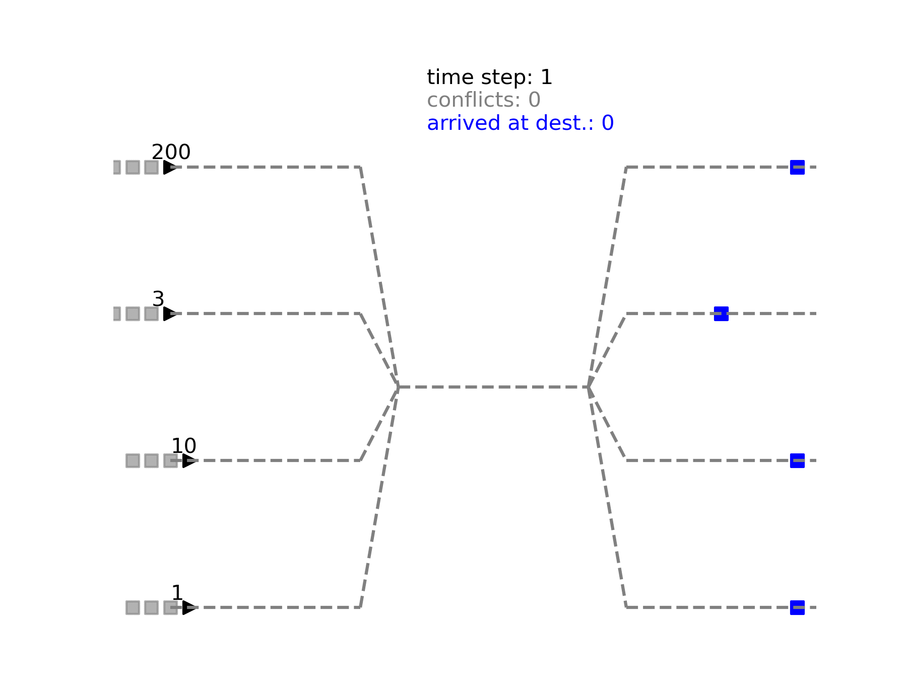

# multi-agent-trains-env

A new environment to simulate the motion of a number of trains on a railway network is presented. This environment is developed to be suitable for testing and development of new multi-agent reinforcement learning algorithms. 



## Problem statement
The environment consists of a number of trains (agents) which are moving on a rail-network. The goals of the agents are to take their passengers **safely** and **efficiently** to their destinations.  The definitions of the safety and efficiency are mentioned below.
Here, each train has:
* an origin (where it starts from), 
* a destination (where it goes to), and 
* a number of passengers on-board.

**Safety**: A safe solution is a solution with zero number of *conflicts*. Here, a conflict occurs when more than one trains are on the same rail segment. For the railway network implemented here, the agents would only have conflicts when they get to the middle part of the network. In principle, if that segment is occupied by a train, all the other trains behind it should avoid getting on that segment, until the segment becomes free. 

**Efficiency**: A solution is efficient if the total amount of waiting time of all the passengers is minimized. Naturally, this leads to higher priority for the trains with larger numbers of agents.

In this environment, the agents collaborate not to have conflicts, while each trying to get its passengers as quickly as possible to their destinations.  

An animation of an instance of the environment for four agents is shown above. The numbers shown on top of the trains represent the number of passengers, and destinations are represented by blue squares. 

## The environment

In the environment the agents are presented by their state which changes by the actions they take. As a result of taking actions, the environment produces a reward.

### Agent state
The state of each agent is a tuple:
* an integer number specifying is the position of agent on the track, and
* an integer number representing the number of passengers on the train.

The global state is the concatenation of the states of all agents.

### Agent actions

Each agent can take two actions:

* stay at the current position (action number 0)
* advance one step forward (action number 1).

### One Step
The environment takes a step, given a list consisting of one action per agent. This is very similar to the ```step``` method in OpenAI Gym, with a difference that here we need to pass the step function a list of actions (one per each agent), not one action.

Similar to the ```step``` function in OpenAI Gym, here step function returns:
* the new global state, 
* a list of rewards (one per agent),
* a list boolean variables indicating the end of the episode for each agent,
* a string of info (which is left empty)

### Reward Engineering

This is the most tricky part! Here, I want the reward to be able to reflect the following considerations:

* the trains should get as fast as possible to their destinations,
* no conflict should arise, and
* the *overall* waiting time should be minimized.

Based on the above criteria, the following scheme is presented for the rewards. 

The reward of each agent is composed of two parts:
* [single part] the reward which depends only on its state, and
* [collective part] the reward which depends on the state of the other agents.

For the first part:
* if the agent moves forward, it is negatively rewarded in proportionality to the number of it passengers,
* if the agent stays still, two times the above reward is considered.

For the collective part, all the agents are punished similarly if a conflict occurs. This part is particularly designed to be independent of the number of the passengers, as it is a matter of safety, i.e. we do not want any crashes!

## How to use the environment
Instantiation, stepping through time, and visualizations are demonstrated in ```simulator.py```. It can be executed by
```python simulator.py```

Different parts of the above script are explained in the following.

### Instantiation 
Here is an example of instantiation of the environment.
```
env = Environment(ls1=10,
                  lc=10,
                  ls2=10,
                  nr_agents=4,
                  states=[0.0, 1.0, 0.0, 10.0, 0.0, 3.0, 0., 200.],
                  time_cost=1,
                  destinations=[29.0, 29.0, 25.0, 29.0],
                  conflict_cost=100.0,
                  nr_actions=2)
```
where:

* `ls1`, `lc`, `ls2`  -- the lengths of the first, second, and the last segments of the railway (`lc` being the `l`ength of the `c`ommon track),
* `nr_agents` -- the number of agents,
* `states` -- the global state of the system, which is a concatenation of states of all the agents. In the example here, the first two elements of the list are position and number of passengers of the first agent (starting at 0 with 1 passenger), the second pair of elements specifies that the second agent is at position 0 with 10 passengers onboard.
* `time_cost` -- the cost of time for each passenger,
* `destinations` -- the list of destinations of agents. For example here the destination of the second agent is 29. Of course all the destinations should be smaller than the total length of the tracks, i.e. smaller than `ls1 + lc + ls2`.
* `conflict_cost` -- the cost of conflicts. The larger the better.
* `nr_actions` -- the number of actions per agent. Currently, there are two.

### Step

 After creating an instance of the environment one can step through time, using step methods:
 ```
 new_global_state, reward_lst, done_lst, info = env.step(actions_lst)
 ```
 where ```action_lst``` is the list of the actions of the agents. In accord with OpenAI Gym implementation of step method, the outputs are:
 
 (i) the new global state, (ii) the list of rewards, (iii) a list of booleans indicating whether each agent has reached its destination, and (iv) some empty info. 
 
 Refer to above Sec. about  **One step** for details of the outputs.

### Other methods
The following methods can be useful for debugging:
* ```render()``` which renders the scene and optionally can save it as an image on the disk.
* ```step_agent(agent_id)``` which takes one step for the specified agent. This is the backbone of the ```step``` function.
* ```conflict_detector()``` returns the number of conflicts at the current time.
* ```get_x_y()``` which returns positions of the agents in two arrays (one for the x- and one for the y-direction).


### Requirements
The following packages are required
* numpy 
* os
* matplotlib 
